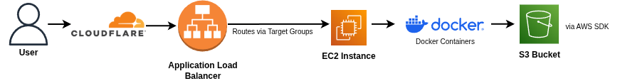

# 🚀 MalaiDeu – AWS File Upload & Storage System

A cloud-based file upload and storage system built on AWS, demonstrating end-to-end DevOps practices including Infrastructure as Code, containerized deployment, and automated CI/CD pipelines.

The application allows users to upload, organize, browse, and retrieve files using Amazon S3 through a Node.js and Express backend. It is deployed on AWS EC2 using Docker, automated through GitHub Actions, and exposed securely through Cloudflare.

---

## 🔗 Live Demo

https://malaideu.pratik-labs.xyz

---

## Architecture Diagram
The following diagram illustrates the end-to-end system architecture:


---

## 📌 Project Overview

This project demonstrates an end-to-end DevOps workflow, covering:

- Infrastructure as Code (Terraform – AWS EC2, S3, IAM, Security Groups)
- Containerized application deployment (Docker)
- Automated CI/CD pipeline (GitHub Actions)
- Image registry integration (GHCR)
- Domain routing and HTTPS (Cloudflare)

This project follows a cloud-native deployment approach where infrastructure, application, and delivery pipelines are separated and automated.

---

## ✨ Features

- Upload multiple files through the web interface
- Upload folders while preserving folder structure
- Create folders and nested folders
- Upload files into selected folders for organization
- Store files securely in AWS S3
- Browse folders, open files, and download files
- Rename files before upload
- Server-side rendering using EJS
- Containerized deployment using Docker
- Automated deployment via CI/CD pipeline

---

## 💻 Local Run

From the application directory:

```bash
cd app/src
npm install
npm start
```
---

## 🏗️ Architecture
The application follows a simple request flow from user to cloud storage:

```text
User (HTTPS)
    ↓
Cloudflare
    ↓
EC2 Instance
    ↓
Docker Container
    ↓
AWS SDK
    ↓
S3 Bucket
```

---

## ⚙️ Tech Stack

- Infrastructure as Code: Terraform
- Cloud: AWS EC2, AWS S3, IAM
- Backend: Node.js, Express.js
- Templating: EJS
- File Handling: Multer
- Cloud SDK: AWS SDK v3
- Containerization: Docker, Docker Compose
- CI/CD: GitHub Actions, GHCR
- Automation: Ansible
- Networking & Security: Cloudflare (DNS + SSL)

---

## 🚀 CI/CD Workflow

On every push to the main branch:

```text
git push
    ↓
GitHub Actions runs workflow
    ↓
Install dependencies (verification step)
    ↓
Build Docker image
    ↓
Push image to GHCR
    ↓
GitHub Actions connects to EC2 over SSH
    ↓
EC2 runs docker compose pull
    ↓
EC2 restarts the container
```

---

## 🌐 Deployment Details

- Application runs on AWS EC2 using Docker
- Domain managed via Cloudflare
- HTTPS enabled using Cloudflare Flexible SSL
- Environment variables stored securely on the server
- Application interacts with S3 using an IAM role (no hardcoded credentials)

---

## 🏗️ Infrastructure as Code
AWS infrastructure for this project is defined using Terraform
Terraform provisions:
- EC2 instance
- S3 bucket
- IAM role
- IAM instance profile
- Security group

This allows the infrastructure to be recreated from code instead of being configured manually through the AWS console.

---

## 🧠 What I Learned
- How to provision AWS infrastructure through code using Terraform
- How to deploy a real application on AWS using Docker
- The difference between infrastructure provisioning and server configuration
- How CI/CD automates image build and deployment
- How IAM roles replace hardcoded credentials
- How DNS and HTTPS are handled through Cloudflare

---
